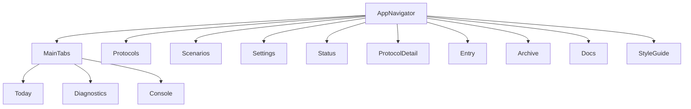
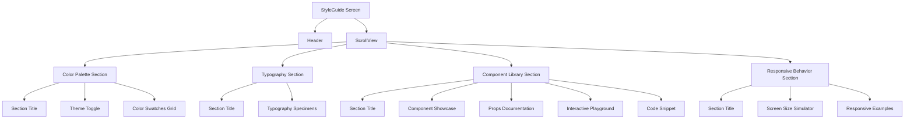
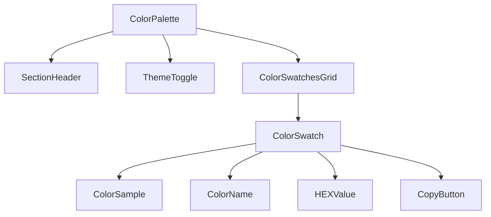
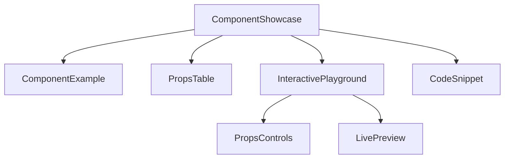

# Live Style Guide Design Document

## Overview
This document outlines the design and implementation of a live style guide for the mobile application. The style guide will be accessible as a dedicated screen within the app and will showcase all design tokens, components, and their usage patterns in an interactive manner.

## Architecture

### Style Guide Screen Integration
The style guide will be implemented as a new screen in the application, accessible through the main navigation. It will be integrated into the existing navigation structure without disrupting the current user flow.

Based on the existing navigation structure in `App.tsx`, the style guide will be added as a new screen in the stack navigator. The screen will be accessible through a dedicated navigation entry, likely added to the Settings or Diagnostics section to avoid cluttering the main tabs.

### Navigation Structure


### Component Structure
The style guide will be composed of several sections:
1. Color Palette - Interactive display of all theme colors with HEX value copying
2. Typography - Showcase of all text styles with size specifications
3. Component Library - Interactive examples of all reusable components with props documentation
4. Responsive Behavior - Demonstration of how components adapt to different screen sizes

## Component Library

### Themed Components
Based on the existing codebase, the following themed components will be documented:
1. ThemedView - A view component with theme-aware background
2. ThemedText - A text component with theme-aware styling
3. ThemedButton - A button component with theme-aware colors
4. ThemedInput - A text input component with theme-aware styling
5. ThemedScrollView - A scroll view with theme-aware background
6. ThemedCard - A card component with theme-aware borders and background
7. ThemedDivider - A divider component with theme-aware color

### Component Documentation Format
Each component will be documented with:
- Visual example
- Props table with descriptions
- Usage code snippet
- Interactive props controls (where applicable)

## Data Models

### Theme Structure
The theme structure follows this interface:

```typescript
interface Theme {
  colors: ColorPalette;
  spacing: SpacingScale;
  padding: PaddingPresets;
  margin: MarginPresets;
  borderWidths: BorderWidths;
  borderRadius: BorderRadius;
  shadows: Shadows;
  zIndex: ZIndexLevels;
  layout: LayoutConstraints;
  typography: TypographySystem;
  textStyles: TextStyles;
  typographyScale: TypographyScale;
}
```

### Color Palette Structure
The color palette is organized as follows:
- Base colors (black, darkGray, mediumGray, lightGray, white)
- Color palette with semantic naming (primary, secondary, background, text, border, status)
- Theme-specific variations (light/dark themes)

## Business Logic Layer

### Color Utility Functions
The style guide will utilize existing color utility functions:
1. getColorWithOpacity - Generate RGBA colors with specified opacity
2. isValidColor - Validate HEX color format
3. adjustColor - Lighten or darken a color
4. getContrastTextColor - Determine contrasting text color for background
5. colorUtils.generateGradient - Create color gradients
6. colorUtils.mixColors - Blend two colors

### Theme Management
The style guide will leverage the existing theme management system:
1. ThemeProvider - Context provider for theme values
2. useTheme - Hook to access current theme
3. ThemeConsumer - Component for class-based theme access
4. toggleTheme - Function to switch between light/dark themes

## User Interface Design

### Color Palette Section
- Interactive color swatches displaying:
  - Color name
  - HEX value
  - Visual sample
- Click to copy HEX value functionality
- Light/dark theme toggle to show theme variations

The color palette section will use the React Native Clipboard API to implement the copy functionality. When a user taps on a color swatch, the HEX value will be copied to the clipboard and a visual feedback will be shown to confirm the action.

### Typography Section
- Specimens for all text styles:
  - Display headings (large, medium, small)
  - Headings (large, medium, small)
  - Body text (large, medium, small)
  - Label text (large, medium, small)
- Each specimen shows:
  - Font family
  - Font size
  - Line height
  - Visual example

The typography section will showcase all text styles defined in the theme system. Each specimen will display the text style name, properties, and a visual example. The specimens will be organized by category (display, heading, body, label) and size (large, medium, small) to make it easy to compare different text styles.

### Component Library Section
Each component will have:
- Visual example with default styling
- Props documentation table:
  - Prop name
  - Type
  - Required/Optional
  - Default value
  - Description
- Interactive playground with adjustable props
- Code snippet showing usage

The interactive playground will use React state to manage the props of each component. Users can adjust props through UI controls (sliders, toggles, text inputs) and see the live preview update in real-time. The code snippet will show the current state of the component with the selected props.

### Responsive Behavior Section
- Demonstration of how components adapt to different screen sizes
- Visual indicators for breakpoints
- Examples of responsive spacing adjustments

The responsive behavior section will simulate different screen sizes using React Native's Dimensions API. It will showcase how components adapt to mobile, tablet, and desktop breakpoints as defined in the theme system. The simulation will use the existing responsive helpers in the theme system to demonstrate proper scaling.

## API Endpoints
Not applicable - Style guide is a client-side feature with no external API dependencies.

## Middleware & Interceptors
Not applicable - Style guide is a presentation layer feature with no middleware requirements.

## Testing Strategy

### Unit Tests
- Component rendering tests for each themed component
- Theme utility function tests
- Color utility function tests
- Theme provider context tests

### Integration Tests
- Navigation integration to ensure style guide is accessible
- Theme switching functionality tests
- Copy to clipboard functionality tests

### Visual Regression Tests
- Snapshot tests for each component style
- Theme variation tests (light/dark modes)
- Responsive behavior tests across screen sizes

## Implementation Plan

### Phase 1: Foundation
1. Create StyleGuide screen component
2. Implement basic navigation to the screen
3. Set up theme context access
4. Create section layout structure

### Phase 2: Color Palette
1. Implement color swatch display
2. Add HEX value display
3. Implement copy to clipboard functionality
4. Add theme variation toggle

### Phase 3: Typography
1. Create typography specimens
2. Display font properties
3. Show visual examples
4. Implement size comparison views

### Phase 4: Component Library
1. Create component showcase for each themed component
2. Implement props documentation
3. Add interactive playgrounds
4. Include code snippets

### Phase 5: Responsive Behavior
1. Implement screen size simulation
2. Show responsive adaptations
3. Create breakpoint visualization
4. Add responsive spacing examples

### Phase 6: Polish and Testing
1. Finalize UI/UX
2. Implement comprehensive tests
3. Optimize performance
4. Documentation review

## UI Component Diagrams

## Conclusion

The live style guide will serve as a comprehensive reference for the application's design system, providing developers and designers with an interactive tool to understand and use the theme system effectively. By showcasing all design tokens, components, and their variations in a single accessible location, the style guide will help maintain consistency across the application and accelerate development.

The implementation will leverage the existing theme infrastructure while adding interactive elements that demonstrate the flexibility and power of the design system. The style guide will be an evolving document that grows with the application, ensuring it remains a relevant and useful resource for the team.

### Style Guide Screen Layout


### Color Palette Component


### Component Showcase Structure
