# White Room Screen Development

## Overview

This document outlines the design for the "White Room" application screens based on the provided requirements. The application consists of multiple interconnected screens that provide users with a structured environment for daily task management, diagnostics, coaching, and protocol execution.

## Architecture

The application follows a mobile-first architecture using React Native with the following key components:

1. **Navigation Layer**: Tab-based navigation with stack navigation for detail screens
2. **State Management**: Zustand for global state with AsyncStorage persistence
3. **Service Layer**: Singleton services for business logic encapsulation
4. **UI Components**: Custom component library with theming support
5. **Data Layer**: Local-first storage using MMKV and SQLite


## Screen Designs

### 1. Entry Screen (ID Assignment)

The entry screen is responsible for generating and assigning a unique user ID.

**Key Features:**
- Generate unique ID in format `User#XXX`
- Store ID locally using MMKV
- Display "Допуск предоставлен" message
- Provide [ Войти ] button to navigate to Today screen
- Prevent showing on subsequent launches

**UI Components:**
1. Full-screen white background
2. Monospace text display for ID
3. Minimal status message
4. Text-only button with brackets [ Войти ]

**State Management:**
```typescript
interface EntryState {
  userId: string | null;
  hasAssignedId: boolean;
  localUserId: string | null;
}
```

**Flow:**
1. Check if user ID already exists in store
2. If exists, navigate directly to Today screen
3. If not exists:
   - Generate new ID in format `User#XXX`
   - Save ID to store
   - Display ID and access granted message
   - Enable [ Войти ] button

### 2. Today Screen (Main)

The main dashboard screen showing daily tasks and metrics.

**Key Features:**
- Contextual instruction/quote of the day
- Minimum focus time element (15-20 min)
- Task list (3-5) with checkboxes
- Book reading task ("Прочитать +10 страниц")
- Mini-report: streak, discipline, focus
- Coach snippet (short)
- Quick actions: "Снизить нагрузку", "Пересобрать план"

**UI Components:**
1. Contextual Instruction Section (card-based layout)
2. Task List with Minimal Checkboxes
3. Progress Visualization (text-based metrics)
4. Mini-Report Cards (clean card layout with ample white space)
5. Coach Message Snippet (console-style text block)
6. Quick Action Buttons (text-only buttons with brackets)

**State Management:**
```typescript
interface TodayState {
  contextualInstruction: string;
  todayTasks: TaskItem[];
  streak: number;
  disciplineScore: number;
  focusTime: number;
  coachMessages: Message[];
}
```

### 3. Diagnostics Screen

Dashboard for daily metrics and diagnostics.

**Key Features:**
- Daily indices (Mind/Body/Social/Discipline)
- Deltas (today vs yesterday comparison)
- Event log: ✓ / ✗ + time
- 7-day bar (minimum completion ✓/✗)
- Coach output: brief daily comment
- Navigation to "System Status" and "Protocols"

**UI Components:**
1. Index Cards (Mind/Body/Social/Discipline) with clean card-based layout
2. Delta Indicators (minimal text-based presentation)
3. Event Timeline (structured list with timestamps)
4. 7-Day Completion Bar (text-based representation)
5. Coach Commentary Section (console-style text block)
6. Text-based Navigation Links

### 4. Console Screen

Command-line interface for coach communication.

**Key Features:**
- Protocol communication in command/line format
- Commands: /minimum, /plan, /lower, /reflect, /start <id>
- System signals displayed as separate lines
- Plan and protocol insertion in coach responses

**UI Components:**
1. Minimal Command Input Field (monospace text input)
2. Command History List (console-style log)
3. System Signal Notifications (text-only alerts)
4. Response Display Area (structured text blocks)

**Supported Commands:**
| Command | Function |
|---------|----------|
| /minimum | Set minimum focus time |
| /plan | Generate/retrieve daily plan |
| /lower | Reduce workload |
| /reflect | Trigger reflection process |
| /start <id> | Start protocol by ID |

### 5. Record Screen

Detailed view for daily records.

**Key Features:**
- Format: "Запись №023 (2025-09-04)"
- Questions: obstacles (chips), mood (☹ 😐 🙂), task completion (checkboxes)
- Compressed day log (✓/✗)
- Coach output: strict and brief (1-2 lines)
- History of 7 latest records
- Navigation to "Protocols"

**UI Components:**
1. Record Header with ID and Date (minimal text formatting)
2. Mood Selection Chips (text-based options)
3. Obstacle Checkboxes (minimal checkboxes)
4. Task Completion List (structured list)
5. Day Log Summary (text-based log)
6. Coach Commentary (console-style text block)
7. Record History List (minimal list with dates)

### 6. Protocol Catalog

Registry of available protocols.

**Key Features:**
- Mind / Body / Social registry
- Table: №, name, duration, level
- Protocol detail screen: execution steps
- Launch: > start <id>

**UI Components:**
1. Domain Filter Tabs (minimal text tabs)
2. Protocol List Table (clean table layout)
3. Protocol Detail View (structured step display)
4. Launch Command Input (minimal text input)

**Protocol Table Columns:**
| Column | Description |
|--------|-------------|
| № | Protocol ID |
| Name | Protocol title |
| Duration | Time in minutes |
| Level | Difficulty level |

### 7. System Parameters

User configuration and system settings.

**Key Features:**
- User ID and goals
- Coach mode: standard / strict
- Daily schedule: wake-up, block count
- Safety signals (sleep deprivation, anxiety, pain)
- Management: "Erase journal", "Erase configuration"
- Access to "Protocol №00"

**UI Components:**
1. User Profile Section (minimal text display)
2. Coach Mode Selector (text-based toggle)
3. Schedule Configuration (structured input fields)
4. Safety Signal Toggles (minimal checkboxes)
5. Data Management Actions (text-only buttons)
6. Documentation Access (minimal link)

### 8. Protocol Archive

Historical record of all protocols.

**Key Features:**
- List of all records: № date dynamics result
- Dynamics displayed with arrows (↑ ↓ →)
- Filters: /all /mind /body /social /focus
- Search: > find 022
- Navigation to "Record №…"

**UI Components:**
1. Protocol List with Dynamics (minimal table layout)
2. Filter Controls (text-based filters)
3. Search Functionality (minimal text input)
4. Record Navigation (text links)

**Filter Options:**
| Filter | Scope |
|--------|-------|
| /all | All protocols |
| /mind | Mind domain |
| /body | Body domain |
| /social | Social domain |
| /focus | Focus-related |

### 9. Scenarios

Fixed scenario management.

**Key Features:**
- List of fixed scenarios (morning, day, evening)
- Scenario screen: step-by-step instructions
- Scenario launch: > start 01

**UI Components:**
1. Scenario List (minimal card layout)
2. Scenario Detail View (structured display)
3. Step-by-Step Instructions (numbered list)
4. Launch Controls (minimal text input)

### 10. System Status

System-wide metrics and status.

**Key Features:**
- Indices: Mind, Body, Social, Discipline
- Weekly deltas (dry numbers, no arrows)
- Strategic coach output (for the week)
- Change history in table format

**UI Components:**
1. Index Dashboard (minimal card layout)
2. Weekly Delta Display (text-based numbers)
3. Strategic Commentary (console-style text block)
4. Change History Table (clean table with minimal styling)

### 11. Protocol №00 (Documentation)

Static documentation and briefing.

**Key Features:**
- Static document-briefing
- Index explanation
- Rules:
  - Minimum 15-20 min
  - Breaks are recorded
  - Coach adjusts load daily
- Available at first launch and in settings

**UI Components:**
1. Document Viewer (minimal text display)
2. Index Reference (structured list)
3. Rule List (numbered text list)
4. Access Points (minimal text links)

## Navigation Flow

```mermaid
graph LR
A[Entry] --> B[Today]
B --> C[Diagnostics]
B --> D[Console]
B --> E[Protocols]
B --> F[Scenarios]
B --> G[Settings]
C --> H[System Status]
C --> I[Protocols]
D --> J[Protocol Detail]
E --> K[Protocol Detail]
E --> L[Protocol Archive]
F --> M[Scenario Detail]
G --> N[Protocol №00]
L --> O[Record]
L --> E
O --> E
```



## Data Models

### User
```typescript
interface User {
  id: string; // User#XXX format
  goals: string[];
  coachMode: 'standard' | 'strict';
  schedule: {
    wakeUp: string; // HH:MM format
    blocks: number;
  };
  safetySignals: {
    sleepDeprivation: boolean;
    anxiety: boolean;
    pain: boolean;
  };
}
```

### Task
```typescript
interface TaskItem {
  id: string;
  title: string;
  completed: boolean;
  completedAt?: string;
  type: 'minimum' | 'regular' | 'book';
}
```

### Protocol
```typescript
interface Protocol {
  id: string;
  title: string;
  domain: 'mind' | 'body' | 'social';
  durationMin: number;
  level: string;
  steps: string[];
}
```

### Record
```typescript
interface Record {
  id: string;
  date: string;
  mood: -2 | -1 | 0 | 1 | 2;
  obstacles: string[];
  tasksCompleted: boolean[];
  log: { status: boolean; time: string }[];
  coachCommentary: string;
}
```

## Business Logic Layer

### ID Generation Service
```typescript
class IdGenerationService {
  generateUserId(): string {
    // Generate unique ID in format User#XXX
  }
  
  saveUserId(id: string): void {
    // Save to MMKV storage
  }
  
  hasAssignedId(): boolean {
    // Check if ID exists
  }
}
```

### Task Management Service
```typescript
class TaskService {
  getTodayTasks(): TaskItem[] {
    // Retrieve today's tasks
  }
  
  completeTask(taskId: string): void {
    // Mark task as completed
  }
  
  generateDailyTasks(): TaskItem[] {
    // Generate context-aware tasks
  }
}
```

### Coach Agent Service
```typescript
class CoachAgentService {
  generateContextualInstruction(): string {
    // Generate instruction based on user state
  }
  
  processCommand(command: string): string {
    // Process console commands
  }
  
  generateCommentary(record: Record): string {
    // Generate coach commentary
  }
}
```

## UI/UX Considerations

### Design Principles
1. **Sterile Interface**: Minimalist design with clean typography, card-based layouts, and ample white space
2. **Text-First Approach**: Emphasis on content with minimal decorative elements
3. **Console-Inspired Aesthetics**: Technical feel with monospace fonts and structured layouts
4. **Consistent Navigation**: Tab-based primary navigation with clear hierarchy
5. **No Animations**: Static transitions to maintain focus on content
6. **High Contrast**: Black text on white background for maximum readability

### Color Palette
- Primary: Black (#000000) for text
- Secondary: White (#FFFFFF) for backgrounds
- Minimal Accents: Light gray (#F5F5F5) for subtle UI elements
- Status Indicators: Minimal use of color only for critical status (green for success, red for warnings)

### Typography
- Monospace font throughout for technical/console aesthetic
- Clear hierarchy with font weights and spacing
- Consistent vertical rhythm and alignment
- Minimal font size variations (14px-18px range)

## Testing Strategy

### Unit Tests
1. ID generation and storage
2. Task completion logic
3. Command processing
4. Data persistence

### Integration Tests
1. Navigation between screens
2. Data flow between components
3. State persistence across sessions

### UI Tests
1. Component rendering
2. User interaction flows
3. Responsive behavior

## Implementation Roadmap

### Phase 1: Core Infrastructure
1. Entry screen implementation
2. ID generation and storage
3. Basic navigation setup

### Phase 2: Main Screens
1. Today screen with task management
2. Diagnostics dashboard
3. Console interface

### Phase 3: Protocol System
1. Protocol catalog
2. Protocol execution
3. Record management

### Phase 4: Advanced Features
1. Scenario system
2. System status
3. Documentation

### Phase 5: Polish and Testing
1. UI refinement
2. Performance optimization
3. Comprehensive testing