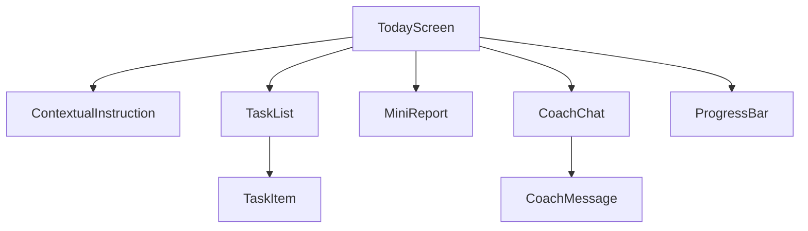
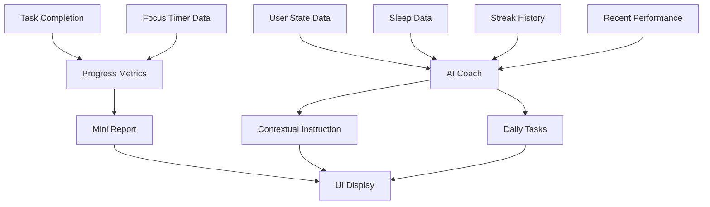
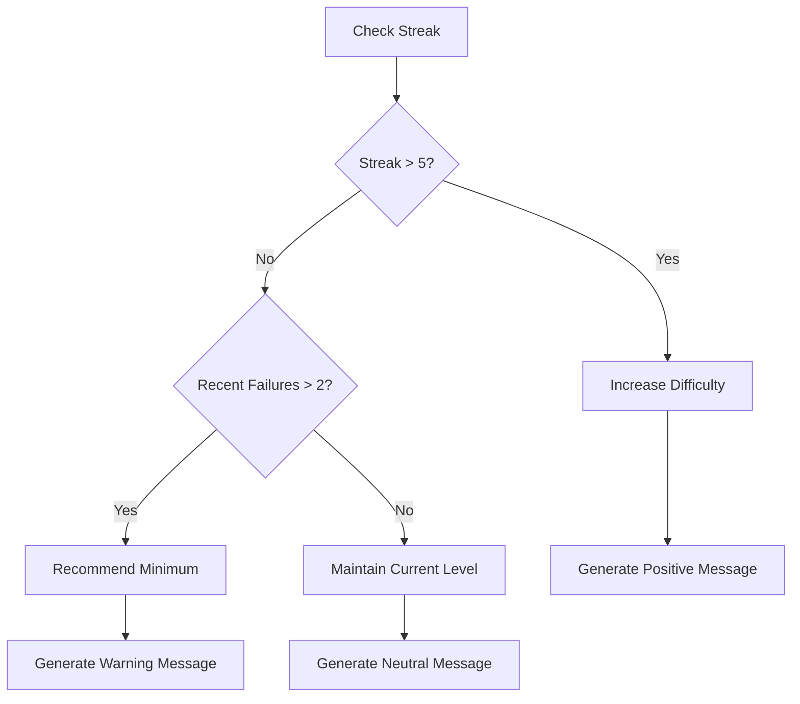

# Today Screen v0.3 Design Document

## 1. Overview

The Today screen is the primary interface for users to view their daily tasks, track progress, and interact with the AI coach. It follows a minimalist design approach with a focus on contextual instructions, concise task lists, and integrated coaching.

This screen integrates with the existing Zustand store for state management, uses the established typography and spacing systems, and follows the same navigation patterns as other screens in the application.

## 2. Component Architecture

### 2.0 Component Hierarchy



### 2.1 Contextual Quote/Instruction Component

- **Location**: Top of the screen
- **Purpose**: Display personalized daily instructions based on user state
- **Data Sources**: 
  - Sleep quality
  - Streak count
  - Recent successes/failures
- **Examples**:
  - "Ты сбился 2 раза подряд. Сегодня держим только минимум. Ответь ОК."
  - "Серия 5 дней! Усложняем: +1 блок Mind"
- **Component Structure**:
  - Text display with `h2` typography style
  - 16px vertical padding
  - System font with bold weight
  - Black text on white background

### 2.2 Daily Tasks List Component

- **Location**: Below contextual instruction
- **Purpose**: Display 3-4 daily tasks generated by the AI coach
- **Task Types**:
  - Minimum cycle (focus)
  - Physical exercises (push-ups, plank, stretching)
  - Social challenges (questions, contacts)
  - Learning blocks (books/flashcards)
- **Features**:
  - Progress bar above the list
  - Book reading as a task item (not separate module)
  - Completion tracking
- **Implementation Details**:
  - Uses `@shopify/flash-list` for efficient rendering
  - Each task item uses `body` typography with 12px vertical padding
  - Checkboxes for task completion tracking
  - Progress bar with 4px height using primary color

### 2.3 Mini Report Component

- **Location**: Below task list
- **Purpose**: Provide compact numerical feedback on user progress
- **Metrics Displayed**:
  - Streak (🔥 6 дней)
  - Discipline Score (72, ↑2 за вчера)
  - Focus time (1ч 40м сегодня)
- **Implementation Details**:
  - Horizontal layout with equal-width columns
  - Uses `caption` typography for labels
  - Uses `mono` typography for numerical values
  - 8px padding around each metric
  - Light gray background (#F5F5F5)

### 2.4 Integrated Coach Chat Component

- **Location**: Integrated within task flow
- **Purpose**: Provide coaching messages as part of task delivery
- **Features**:
  - First task presented as coach message
  - "Open full chat" button at bottom
  - System-style blocks rather than messenger-style UI
- **Implementation Details**:
  - Uses card-based layout with 12px padding
  - Light gray background (#F5F5F5)
  - "Open full chat" button uses primary button styling
  - Monospace font for coach messages

## 3. Data Flow



## 4. State Management

### 4.1 Zustand Store Integration

Based on the existing `useStore` implementation, the Today screen will extend the existing store with additional properties:

- **Store Extension**: Add properties to existing `AppState` interface
- **State Properties**:
  - `contextualInstruction: string`
  - `todayTasks: TaskItem[]` (extends existing `todayTasks: string[]`)
  - `streak: number` (from Stats interface)
  - `disciplineScore: number` (from Stats interface)
  - `focusTime: number`
  - `coachMessages: Message[]`
- **Persistence**: Uses MMKV storage with version 1
- **Actions**:
  - `setContextualInstruction: (instruction: string) => void`
  - `updateTask: (index: number, task: TaskItem) => void`
  - `setStreak: (streak: number) => void`
  - `setDisciplineScore: (score: number) => void`
  - `setFocusTime: (minutes: number) => void`

### 4.2 Data Sources

- **MMKV Storage**: 
  - User preferences
  - Streak data
  - Quick state flags
- **SQLite Database**:
  - Task completion history
  - Focus session data
  - Performance metrics
- **Integration with Existing Types**:
  - Uses `Stats` interface for streak and discipline metrics
  - Uses `Session` interface for focus time tracking
  - Uses `StateVector` for AI coach context

## 5. UI/UX Design

### 5.1 Visual Hierarchy

1. Contextual instruction (most prominent)
2. Task list with progress indicator
3. Mini report (compact)
4. Integrated coach messages

### 5.2 Design System Integration

Follows the established design system from `/src/theming/`:
- Typography: Uses `h2` for instructions, `body` for tasks, `caption` for labels, `mono` for metrics
- Spacing: Uses predefined spacing scale (16px screen padding, 12px card padding, 8px element padding)
- Colors: Black (#000) text on white (#FFF) background, with light gray (#F5F5F5) for card backgrounds

### 5.2 Design Principles

- Minimalist aesthetic (Notion-style)
- Clean typography with ample white space
- Card-based layout for components
- System-style UI elements (no chat bubbles)
- Monospace font for numerical data

### 5.3 Component Specifications

| Component | Typography | Spacing | Colors |
|-----------|------------|---------|---------|
| Contextual Instruction | h2 (20px bold) | 16px bottom margin | #000 text, #FFF background |
| Task Items | body (16px regular) | 12px vertical padding | #000 text, #FFF background |
| Progress Bar | 4px height | 8px vertical margin | #111 track, #000 fill |
| Mini Report | caption (14px regular) | 8px vertical padding | #666 text, #F5F5F5 background |
| Coach Messages | body (16px regular) | 12px padding | #000 text, #F5F5F5 background |

### 5.4 Styling Implementation

- Uses StyleSheet.create for component styling
- Follows existing pattern from other screens
- Consistent with minimalist design principles
- No shadows or rounded corners

## 6. API Integration

### 6.1 AI Coach Integration

Based on the architecture document, the AI integration will be provider-agnostic HTTP with function calling:

- **Endpoint**: Configurable via `apiBaseUrl` in app.json
- **Method**: POST
- **Request Body**:
  ```typescript
  {
    userId: string;
    stateVector: StateVector; // From existing types
    userProfile: UserProfile; // From existing types
  }
  ```
- **Response**:
  ```typescript
  {
    contextualInstruction: string;
    tasks: TaskItem[];
    nonce: string; // For idempotency
  }
  ```
- **Reliability Features**:
  - 12s timeout
  - Exponential retries (500ms * 2^n, max 3)
  
### 6.2 Task Completion Tracking

- **Endpoint**: `/api/tasks/complete`
- **Method**: POST
- **Request Body**:
  ```typescript
  {
    taskId: string;
    completedAt: string;
    userId: string;
    nonce: string; // For idempotency
  }
  ```
- **Local Storage**: Updates both MMKV and SQLite
- **Sync Strategy**: Queue-based sync to backend when online
  - Rate limiting (≥5s between calls)
  - Offline fallback with local templates

### 6.2 Task Completion Tracking

- **Endpoint**: `/api/tasks/complete`
- **Method**: POST
- **Request Body**:
  ```typescript
  {
    taskId: string;
    completedAt: string;
    userId: string;
    nonce: string; // For idempotency
  }
  ```
- **Local Storage**: Updates both MMKV and SQLite
- **Sync Strategy**: Queue-based sync to backend when online

## 7. Business Logic

### 7.1 Contextual Instruction Generation



### 7.2 Task Prioritization Logic

Based on existing `Domain` and `PlanBlock` types:
1. Minimum cycle task (focus) - always first
2. Physical exercise (body domain) - based on schedule
3. Social challenge (social domain) - based on schedule
4. Learning block (mind domain) - book/flashcards

### 7.3 Progress Calculation

Uses formulas from architecture document:
- SR (Success Rate) = required_completed / required_total
- FOCUS_NORM = clamp(focus_minutes/60, 0, 1)
- TTS_NORM = clamp(median_TTS/60s, 0, 1)
- Discipline = clamp(round((0.5*SR + 0.3*FOCUS_NORM + 0.2*(1-TTS_NORM))*100), 0, 100)
- EMA(α=0.2) for focus/failures tracking

### 7.2 Task Prioritization Logic

1. Minimum cycle task (always first)
2. Physical exercise (based on schedule)
3. Social challenge (based on schedule)
4. Learning block (book/flashcards)

## 8. Testing Strategy

### 8.1 Unit Tests

- Contextual instruction generation logic
- Task prioritization algorithm
- Progress calculation functions
- State management reducers
- AI response parsing with Zod validation

### 8.2 Component Tests

- Rendering of contextual instruction with different states
- Task list display and interaction
- Mini report data formatting
- Coach message integration
- Progress bar calculation

### 8.3 E2E Tests

- Loading screen with different user states
- Completing tasks and updating progress
- Navigating to full coach chat
- Handling offline scenarios
- Task completion sync to SQLite

### 8.4 Testing Tools

- Jest for unit tests
- React Native Testing Library for component tests
- Detox for E2E tests (key scenarios)

## 9. Performance Considerations

- Lazy loading of coach messages
- Efficient rendering of task lists with FlashList (`@shopify/flash-list`)
- Memoization of progress calculations
- Offline-first data loading
- Bundle size optimization (< 2.0 MB gzip)
- Cold start time ≤ 2.5s (Pixel 4a)
- SQLite database indexing for quick lookups
- Zustand state memoization
- Image optimization (if any images are used)

## 10. Accessibility

- All interactive elements with `accessibilityRole`/`accessibilityLabel`
- Minimum 7:1 color contrast
- VoiceOver/TalkBack support
- Proper focus management
- Semantic HTML structure
- Screen reader-friendly labels
- Keyboard navigation support

## 11. Implementation Plan

### 11.1 Phase 1: Basic Structure and UI Components

1. Create Today screen component structure
2. Implement Contextual Quote/Instruction component
3. Implement Daily Tasks List component with mock data
4. Implement Mini Report component
5. Implement Integrated Coach Chat component

### 11.2 Phase 2: State Management and Data Integration

1. Extend existing Zustand store with Today screen properties
2. Implement data fetching from MMKV and SQLite
3. Connect components to store
4. Implement task completion logic

### 11.3 Phase 3: AI Integration and Business Logic

1. Implement AI coach integration service
2. Add contextual instruction generation logic
3. Implement task prioritization algorithm
4. Add progress calculation functions

### 11.4 Phase 4: Testing and Refinement

1. Write unit tests for business logic
2. Write component tests for UI elements
3. Implement E2E tests for key user flows
4. Performance optimization and accessibility improvements

## 12. Directory Structure

```
src/
  screens/
    Today/
      index.tsx          # Main screen component
      components/
        ContextualInstruction.tsx
        TaskList.tsx
        TaskItem.tsx
        MiniReport.tsx
        CoachChat.tsx
        ProgressBar.tsx
      hooks/
        useTodayData.ts   # Custom hook for data fetching
      utils/
        taskUtils.ts      # Task prioritization logic
        progressUtils.ts  # Progress calculation functions
      types.ts            # Today screen specific types
```

## 13. Dependencies and Imports

### 13.1 External Dependencies

- `react` and `react-native` for core functionality
- `zustand` for state management (already in project)
- `react-native-mmkv` for local storage (already in project)
- `expo-sqlite` for database operations (already in project)
- `@shopify/flash-list` for efficient list rendering (already in project)
- `zod` for data validation (already in project)

### 13.2 Internal Imports

- `useStore` from `src/store/useStore.ts`
- Typography and spacing from `src/theming/`
- Domain types from `src/domain/types.ts`
- Utility functions from `src/utils/`

## 14. Error Handling and Edge Cases

### 14.1 Data Loading Errors

- Handle cases where MMKV or SQLite data is corrupted
- Provide fallback values for missing data
- Display user-friendly error messages

### 14.2 Network Errors

- Gracefully handle AI coach API failures
- Use offline fallback templates
- Queue requests for retry when connectivity is restored

### 14.3 Empty States

- First-time user experience
- No tasks generated scenario
- Empty task completion history

### 14.4 Performance Edge Cases

- Slow device handling
- Large task lists optimization
- Memory management for long sessions

## 15. Development Milestones and Acceptance Criteria

### 15.1 Milestone 1: Basic UI Implementation

**Acceptance Criteria**:
- Contextual instruction component displays static text
- Task list renders with mock data
- Mini report shows placeholder metrics
- Coach chat component renders with sample message
- Screen follows design system guidelines

### 15.2 Milestone 2: State Management Integration

**Acceptance Criteria**:
- Today screen connects to Zustand store
- Task completion updates UI
- Progress metrics update in real-time
- Data persists across app sessions

### 15.3 Milestone 3: Data Layer Integration

**Acceptance Criteria**:
- Data loads from MMKV and SQLite
- Task completion saves to local storage
- Progress metrics calculated from real data
- Error handling for data operations

### 15.4 Milestone 4: AI Integration and Testing

**Acceptance Criteria**:
- AI coach generates contextual instructions
- Tasks are dynamically generated
- Offline fallback works correctly
- All unit and component tests pass
- E2E tests cover key user flows
