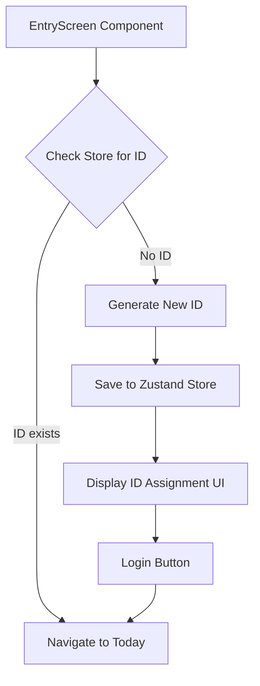
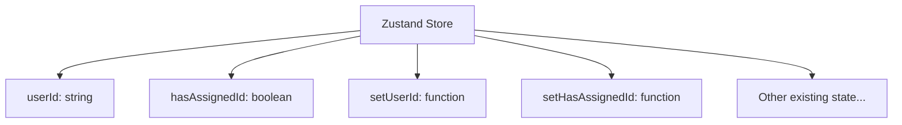
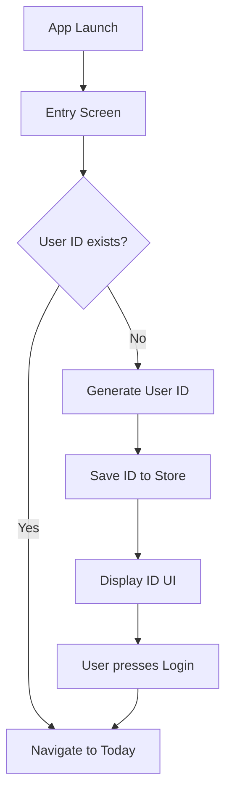

# User ID Generation Feature Design

## Overview

This document describes the design for implementing a user ID generation feature that assigns a unique identifier to users upon first launch of the application. The ID will be generated locally without network requests and stored persistently using MMKV through Zustand.

## Requirements

### Functional Requirements
1. Generate a unique user ID in the format `User#<XXX>` on first app launch
2. Store the ID persistently using MMKV (through Zustand)
3. Display a minimal UI with the assigned ID and a login button
4. Skip the ID assignment screen on subsequent launches
5. Navigate to the "Today" screen when the login button is pressed

### Technical Requirements
1. All implementation must be local (no network requests)
2. ID must be unique per device and persist between sessions
3. ID should only be regenerated if app data is cleared
4. Implementation must work within Expo Managed Workflow
5. Follow existing project architecture patterns

### UI/UX Requirements
1. Minimalist black and white interface
2. Display exactly 3 lines of text and one button
3. Use monospace font for text elements
4. Button should be "dry" (no colors or icons)
5. Create a "system access" atmosphere

## Architecture

### Component Structure
The implementation will modify the existing Entry screen to handle ID generation and display. The component will:
1. Check if a user ID already exists in the store
2. If not, generate a new ID and save it to the store
3. Display the ID assignment UI
4. Provide a login button to navigate to the Today screen

### Component Diagram


### Data Flow
1. On component mount, check for existing user ID in Zustand store
2. If no ID exists:
   - Generate new ID in format `User#<hash>`
   - Store ID in Zustand which persists to MMKV
3. Display UI with assigned ID
4. On button press, navigate to Today screen

### State Management
The user ID will be stored in the existing Zustand store with MMKV persistence. The store will be extended to include:
- `userId`: string - the unique user identifier
- `hasAssignedId`: boolean - flag indicating if ID has been assigned

### Store Structure


## Implementation Details

### ID Generation Algorithm
The user ID will be generated using a hash of the current timestamp to ensure uniqueness:
```
User#{timestamp_hash}
```

Where `timestamp_hash` is a 3-digit hash derived from the current timestamp.

### UI Components
The Entry screen will be modified to include:
1. A loading state while checking for existing ID
2. An ID display view showing the assigned user ID
3. A login button to navigate to the Today screen
4. Proper styling following the minimalist design requirements

### Navigation Flow
1. App launches → Entry screen
2. Entry screen checks for existing user ID
3. If ID exists → Navigate directly to Today screen
4. If no ID exists → Generate ID, display UI, wait for user action
5. User presses login button → Navigate to Today screen

### Flow Diagram


## API Specification

### Store Interface Extension
The Zustand store will be extended with the following properties:
```typescript
interface AppState {
  userId: string | null;
  hasAssignedId: boolean;
  setUserId: (id: string) => void;
  setHasAssignedId: (assigned: boolean) => void;
}
```

### ID Generation Function
```typescript
generateUserId(): string {
  // Generate a hash from current timestamp
  const timestamp = Date.now();
  const hash = (timestamp % 1000).toString().padStart(3, '0');
  return `User#${hash}`;
}
```

## UI Design

### Layout Structure
```
[Container - Full screen, white background]
  ├── [Text - "Assigning ID..."]
  ├── [Text - "User#023"]
  ├── [Text - "Допуск предоставлен."]
  └── [Button - "[ Войти ]"]
```

### UI Layout Diagram
```mermaid
graph TD
    A[View - White Background] --> B[Text - "Assigning ID..."]
    A --> C[Text - "User#023"]
    A --> D[Text - "Допуск предоставлен."]
    A --> E[Button - "[ Войти ]"]
```

### Styling Requirements
- Background: Pure white (#FFFFFF)
- Text: Pure black (#000000)
- Font: Monospace
- Button: Text only, no background, borders, or colors
- Spacing: Minimal but sufficient for readability

## Testing Strategy

### Unit Tests
1. Test ID generation function produces correct format
2. Test ID uniqueness over multiple calls
3. Test store integration for ID persistence
4. Test navigation logic based on ID existence

### UI Tests
1. Snapshot test for ID assignment screen
2. Verify color scheme (black text on white background)
3. Verify text content and formatting
4. Verify button styling matches requirements

### Integration Tests
1. Test complete flow from first launch to Today screen
2. Test subsequent launches skip ID assignment
3. Test ID persistence across app restarts

## Migration Considerations

Since this is a new feature, no data migration is required. However, the Zustand store version may need to be incremented to accommodate the new state properties.

## Security Considerations

- User IDs are generated locally and never transmitted
- No sensitive data is exposed through the ID
- IDs are not predictable due to timestamp-based generation
- Storage uses MMKV which provides basic data protection

## Performance Considerations

- ID generation is computationally lightweight
- MMKV provides fast read/write operations
- No network dependencies affect performance
- Minimal UI components reduce rendering overhead